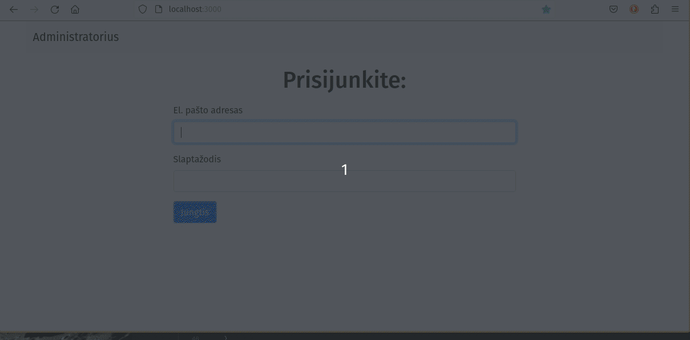

# 🪧 Express login and save users to json file

## 📋 About

Learning node express routing.

This is simple login admin page made with node express server.

After task was done, to practice more, added extra functionality to logout, display user name and pass some messages thought url queries.

Database - json file;

No validations;

**Login, logout- just redirects, can be easily bypased.**

🎯 **Goals:**

[link to task (lt)](./README-task-lt.md)

### Task 1 (30min)

Create login page with a form of two fields: email and password.

Pass form data to separate route using POST method.
Check if login data match email: admin@bit.lt and password: 1234

If login details did not mach redirect user back to login page.

If login successful - redirect user to new route '/admin';

### Task 2

Add functionality to add new users on admin page by entering their name, surname, email and password.

Save data in JSON database.

New created users must be able to login as admin;

### 🏁 Getting started

**Must have [Node.js](https://nodejs.org)** installed

1. Clone the repo
2. Go into project directory and Install NPM packages

   ```sh
   npm install
   ```

3. use application:

   ```sh
   npm start
   ```


